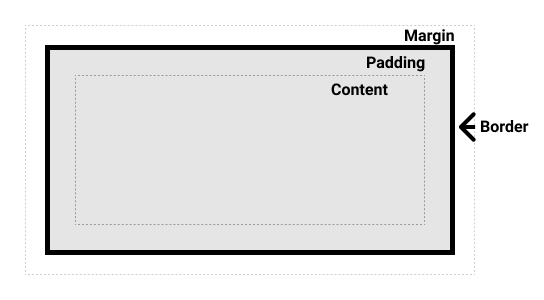
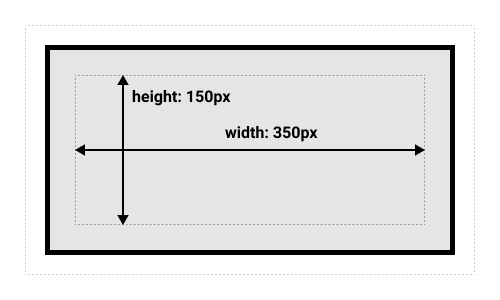
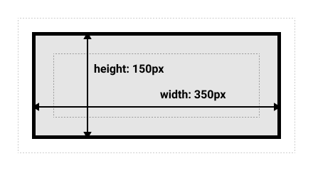

*Source: [The box model](https://developer.mozilla.org/en-US/docs/Learn_web_development/Core/Styling_basics/Box_model)*

Everything in CSS has a box around it.

# 1 Block and inline boxes

Box types 有 **block boxes** 和 **inline boxes**. Type 决定了 boxes 在 page flow 中的表现以及与其他 boxes 的关系.

Boxes 有 **inner display type** 和 **outer display type**. 可以通过 [`display`](https://developer.mozilla.org/en-US/docs/Web/CSS/Reference/Properties/display) 属性来设置.

如果是 `block`, 则:

- Box 会独占一行.

- `width` 和 `height` 属性会生效.

- Padding, margin and border 和与其他 boxes 产生间隔.

- 如果 `width` 没有指定, box 会自动沿着 inline direction 填充其 container 的可用空间.

如果是 `inline`, 则:

- Box 不会独占一行.

- width, height, and top and bottom margin 不会生效.

- Top and bottom padding and borders 会改变 box size, 但不会影响周围其他 boxes 的布局, 即 overlapping.

- Left and right padding, margins, and borders 会影响周围其他 boxes 的布局.


# 2 Inner and outer display types

Outer display type 影响 box 与其周围 boxes 间的布局关系. Inner display type 决定了 box 内部元素的布局方式.


# 3 What is the CSS box model?

CSS box model 整体上适用于 block boxes. Inline boxes 只使用了 box model 中的部分行为.

Box model 有 standard 和 alternate 两种类型, 默认是 standard.

## 3.1 Parts of a box



一个 block box 由以下部分组成:

- **Content box**: 内容展示的区域. 使用 `width` 和 `height` 调整.

- **Padding box**: Content 外围的 white space. 使用 `padding` 调整.

- **Border box**: 包裹 content 和 padding. 使用 `border` 调整.

- **Margin box**: 最外围 layer, 与其他 boxes 之间的 whitespace. 使用 `margin` 调整.

其中 box 的区域到 border 为止.

## 3.2 The standard CSS box model

`width` 和 `height` 属性仅仅作用于或指的是 *content box*.



## 3.3 The alternative CSS box model

`width` 和 `height` 属性作用于或者指的是 *border box* 及其其中区域.



因为从视觉上来上, 该 box model 更加符合直觉, 因而多数 developer 会采用并作为默认方式:

```css
html {
  box-sizing: border-box;
}
```

# 4 Margins, padding, and borders

## 4.1 Margin

有 4 个方向可以分别设置, 值可以为负值.

### Margin collapsing

如果两个 box 的 margin 相遇, 将根据二者的正负取值区分:

- 两个正值选最大

- 两个负值选最小

- 一正一负选差值

## 4.2 Borders

有 4 个方向可以分别设置, 还可以设置 width, style 和 color.

## 4.3 Padding

有 4 个方向可以分别设置.

# 5 The box model and inline boxes

- `width`, `height`, top and bottom `margin` 不生效.

- Top and bottom `padding` 和 `border` 生效, 会 overlapping, 但不影响周围的内容.

- Left and right `padding`, `margin` 和 `border` 会影响周围的内容.

简单来说, 就是 *content box* 失效, 由于 `margin` 会影响周围的 content, 因而只有 incline 方向会生效, 其他属性各个方向都会生效, 但是对于上下方向只会 overlapping.

# 6 Using `display: inline-block`

使得 inline block 表现得跟 block 一样, 但是不会独占一行.

