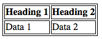
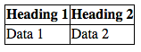

*Source: [Styling tables](https://developer.mozilla.org/en-US/docs/Learn_web_development/Core/Styling_basics/Tables)*

# 1 A typical HTML table

示例: [原始表格](https://developer.mozilla.org/en-US/play?uuid=999f86ededcd2dbca6d770642d11f49814f22929&state=nZVtb9MwEMe%2FyslvCtJEKA%2BbWmWVug0Y6jYhlb1A6hs3vtRmti%2ByL906xHdHCR1kc0dL3%2BThn7P9u%2F%2BdnR9Cs7NiKHKWc4ujmQfIC1mxId%2B%2BAIwh1s7JsAIqgTXC9aQXwVFkKKWjOkJV%2BxuYS69iOzzrjs9Zo1TrqXIO66f2A8SCKjyeiYLsTIxOpFd5xvofId9QBigpONwWeUWvGt6xndcubom97OQSyS864Xm2Rm60h0RynpNabckp0G2TU31%2FX1Bx8xRBjfqDo8M8Y%2FVIHCTKhyUGKKW16MF4sLREeHFrmoXIIXmEFdUQNdVW%2BR73lviyM8cf%2FG2cXzXCqZVR78aZKhfkFXk4ldaa1sG9EM6k80lpn2Hov06kqZNRg2Goq30IpngHX0xkshvL9T5FSJSxl6HQq6ZUv7fKXhxaOjgc7GjD20T6XEJj5sSoCOOAcO0Nt67%2BP4mh%2Bi4aBOlVm9CJ9FEj7tjO%2FdSgc%2FILmDSXTzIo9HtRsSlLuDDMFuGj8QsMG4GOduqZOlZYMJzh0hS4b%2BNOOUi%2FsM%2BAvEtBUrYrgksKCOcYqDU4AcmzvwdPziUR78IHBdlYSX88E28aWmJpQW46F9WT0EcGdinWS%2BfZw09DHIgiRjEU4kB8X99Zo0MxFNYsNIufvwA%3D&srcPrefix=%2Fen-US%2Fdocs%2FLearn_web_development%2FCore%2FStyling_basics%2FTables%2F), [美化后的表格](https://developer.mozilla.org/en-US/play?uuid=122e5c3190e6b1bfde492dbf8111f271e4f1e41a&state=rVZtb9s2EP4rBxVb4iyy4ry0iOJ0S1%2B2DH3BsKwfBugLTZ4kNhRPIE%2BO3aL%2FfaAsJ4rVvDSYDRvU8TnyubvnSH2NSq5MlEZTFjODLzMLMJWiZk22fQA4A99UlXBLoBy4RPj0bstDRZ4hFxU1HurGXsJMWOVb96TvP%2BUSheqWmrLrRu0EeEk1nmaRJJNFL18Jq6YJl%2FdA%2FkXhICdX4UPIjzQOfM%2FMrKn8A9gPvVg82aIHnyYd5WBbBzLlGanlAzE5ugoxNV%2B%2BSJKXmxTUy8nxi%2BfThNUt4%2FHA8naODnJhDFrQFgzNEbavdNiIKiSLsKQGfEmNUXaLt%2BY46q1xTf8hnv%2BUCK%2BN8OXjeA4t78kqsvBaGKPbDD6JwhtR2UFp7%2BAw2RuYLirhS9AMTf0UBhe4gL%2B0ZzLfLdfRkMLAcmaFk%2BUylGrVKk%2FiUYoKnh8%2FMg0HA9OfOYRkvtPKw5lD%2BGQ1t1n9cSaamoXXCMKqNqBXwvoS8ZFyngwTdE62gHfh7w%2FhFNonsWKd5%2FBeMxuE37Ut0H2X0ItHaabxNUqGNzjXEp8q3At2whbmDiKHQyJDbh8JPpBDOEdHbYIHRKbJzcEz5ZyIH8MPJBlfC3uaRfuBLbEwIL53LqoN6K0E9ll0W0%2BT9aUR7UbS%2ByiNkh3IyTLoqibHsJNk9rdunEUlc%2B3TJAkIPy6ICoOi1n4sqUqk9%2Fu%2F5qLSZnn6N8nLXy6E4Z%2BV9rURy1N%2FJeosOslsZpMd8LWQ2hbt8i0F%2BBqYtcPYiCU1nEKuF6hOgv1KKy5TmOzt%2FdQ%2Bz8gpdLEkY0TtMYX1qDebwkG9AE9GK6gbV5sw%2BS3s394DwOVqT6MtxiXqouQUJuOjTVRquYxlqY3anoxWLh2dg5bNXeD92%2BD9e8EHt8GTo%2FvAhxs0%2BuDdzLJaTddCKW2LsHW9WCOSHeBlTYUTdbls0x9eH1YOoarxqoApZNE5mjmylgI%2BYoNZtNu3rR7PnBYmDL2wPvbodL7JOxAKarvO98YuQSkQlBKWkY3zet4rVFciZEYXd6JJYf8mnnWwm5BJDxJaDtZAxgXHwujCpiDRMrpr3C2afZwL4uhlsM2eln4l3xDodZSt70zIy8JRY1UKjTPbN41TKTsuNJfNbKwpMSic1baIhUMR%2BifxvAy3bzyjBd48tW3hE4NUC6f8pbbjz3WRRaNW7pIMuRSuSs0DifeyfzNUQ5ahCYSLCyeURsvbTDAjZqp2wRWz7T0I3wT2xpPRpuVoNHqo67ps%2BlIoumprc%2F2bGSEvNyrlelonpUabdOMu4md5fnAg5T3eOEd7tzseHh%2Fh4ab7AK4rUeD%2FWkhL2uO4tl0JV9vfnIIPRprsQPeG3ipwPf6B9hqeDp1nYIopaBZGy5W8VqvHXitMO1X0dffsefs5uatp7unNaDf6HO6caDfiEiuM0sgEr%2Bjbfw%3D%3D&srcPrefix=%2Fen-US%2Fdocs%2FLearn_web_development%2FCore%2FStyling_basics%2FTables%2F)

> In this article, we'll get you to mark it up using some best practices for table design — as outlined in [Web Typography: designing tables to be read not looked at](https://alistapart.com/article/web-typography-tables/)

# 2 Updating the font

选择合适主题的 font.

```css
html {
  font-family: "Helvetica", "Arial", sans-serif;
}
```

# 3 Spacing

```css
table {
  table-layout: fixed;
  width: 90%;
  margin: 10px auto;
  border-collapse: collapse;
}

th,
td {
  padding: 0.6em;
}
```

- [`table-layout`](https://developer.mozilla.org/en-US/docs/Web/CSS/Reference/Properties/table-layout): 设为 `fiexed` 让列宽根据 heading 的宽度而定, 而不是根据其所包含的 content 而定. 

> Chris Coyier discusses this technique in more detail in [Fixed Table Layouts](https://css-tricks.com/fixing-tables-long-strings/).

- [`border-collapse`](https://developer.mozilla.org/en-US/docs/Web/CSS/Reference/Properties/border-collapse): 设为 `collapse` 让格子间的 border 合并.

默认样式:

<div align="center">
  
</div>


变为:

<div align="center">
  
</div>

# 4 Alignment

内容水平对齐. 例如:

```css
text-align: left;
```

> 其实应该叫 horizontal-align, 历史原因.

内容垂直对齐. 例如:

```css
vertical-align: top;
```

# 5 Adding borders

例如:

```css
border-top: 1px solid #999999;
border-bottom: 1px solid #999999;
```

# 6 Zebra striping

使用 [`:nth-child`](https://developer.mozilla.org/en-US/docs/Web/CSS/Reference/Selectors/:nth-child) pseudo-class 可以选择特定的子元素.

比如:

```css
:nth-child(2)
```

选中第 2 个元素.

也可以填入 formula:

```css
:nth-child(2n+1)
```

选中选中所有奇数个子元素, 等价使用关键字:

```css
:nth-child(odd)
```

# 7 Styling the caption

值得注意的是 [`caption-side`](https://developer.mozilla.org/en-US/docs/Web/CSS/Reference/Properties/caption-side) property.

例如让 caption 位于 table 底部:

```css
caption-side: bottom;
```

# 8 Finished table

```css
html {
  font-family: "Helvetica", "Arial", sans-serif;
}

table {
  table-layout: fixed;
  width: 90%;
  margin: 10px auto;
  border-collapse: collapse;
  border-top: 1px solid #999999;
  border-bottom: 1px solid #999999;
}
th,
td {
  vertical-align: top;
  padding: 0.3em;
}

tr :nth-child(2),
tr :nth-child(3) {
  text-align: right;
  width: 15%;
}

tr :nth-child(1),
tr :nth-child(4) {
  text-align: left;
  width: 35%;
}

tfoot tr :nth-child(1) {
  text-align: right;
}

tfoot tr :nth-child(2) {
  text-align: left;
}

tfoot {
  border-top: 1px solid #999999;
}

tbody tr:nth-child(odd) {
  background-color: #eeeeee;
}

caption {
  padding: 1em;
  font-style: italic;
  caption-side: bottom;
  letter-spacing: 1px;
}
```

