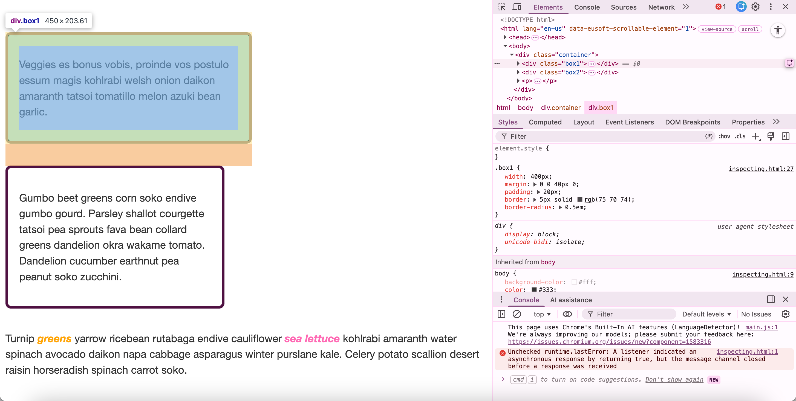
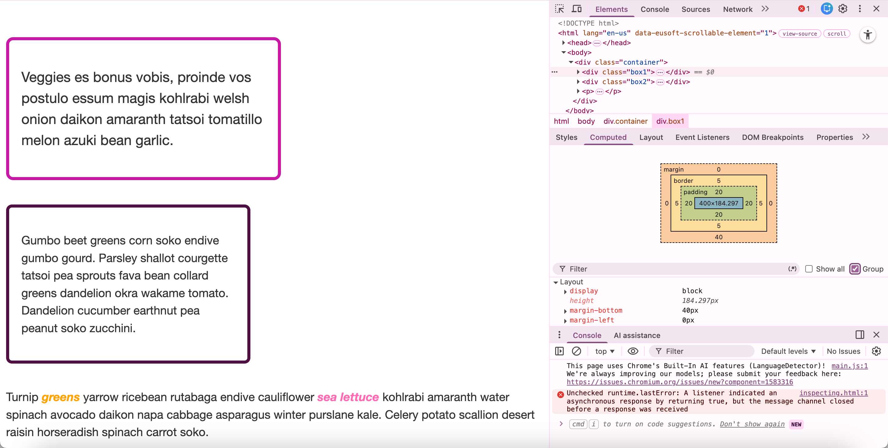
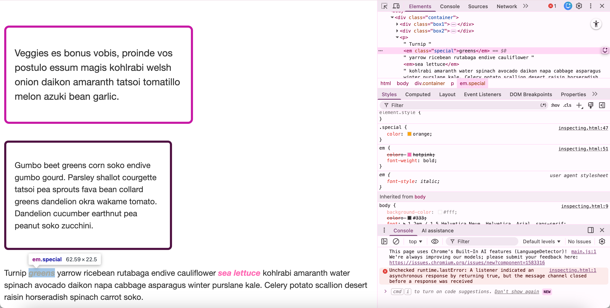
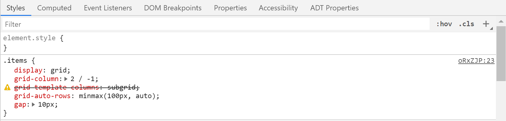

*Source: [Debugging CSS](https://developer.mozilla.org/en-US/docs/Learn_web_development/Core/Styling_basics/Debugging_CSS)*

# 1 The DOM versus view source

在 [HTML Pane](https://firefox-source-docs.mozilla.org/devtools-user/page_inspector/ui_tour/index.html#html-pane) 看到的代码和源代码会存在差异, 因为渲染过后, browser 会纠正源代码, 并执行 JS 所引起的更改.

[本文示例网页](https://mdn.github.io/css-examples/learn/inspecting/inspecting.html).

# 2 Inspecting the applied CSS

通过开发者工具可以查看:

右侧的 Styles 栏 (Rules view) 可以查看应用到该 element 上的 css.

其 value 展现形式为 longhand, 并且可以通过 checkbox 打开或关闭.

# 3 Editing values

property values 可以编辑和预览.

# 4 Adding a new property

点击 closing curly brace 可以添加 property.

# 5 Understanding the box model

右侧的 Computed 栏 (Layout view) 可以查看 box model.

# 6 Solving specificity issues

当应用了 CSS 却不生效, 可能是因为被某个更 specific 的 CSS 覆盖了.

可以检查该元素上的 CSS specificity:

例如该字体的 `color` 最终应用了 `orange`.

# 7 Debugging problems in CSS

## 7.1 Take a step back from the problem

放轻松.

## 7.2 Do you have valid HTML and CSS?

当源代码中有错误时, broswers 会尝试修复, 不同的 browser 的尝试可能也会不同.

所以确保代码是正确的:

- [CSS Validator](https://jigsaw.w3.org/css-validator/)

- [HTML validator](https://validator.w3.org/)

## 7.3 Are the property and value supported by the browser you are testing for?

Browsers 会忽略无法理解的 CSS.

例如这里直接直接删除线表示.

## 7.4 Is something else overriding your CSS?

略略略.

## 7.5 Make a reduced test case of the problem

逐步剔除与 issue 无关的 JS, HTML, CSS.

