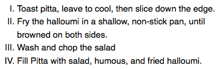
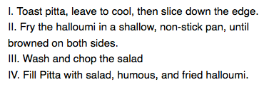

*Source: [Styling lists](https://developer.mozilla.org/en-US/docs/Learn_web_development/Core/Text_styling/Styling_lists)*

[List](https://developer.mozilla.org/en-US/docs/Learn_web_development/Core/Structuring_content/Lists) 表现得像大多数 text 一样, 但是有一些 specific properties.

# 1 A simple list example

Unordered, ordered, and description lists 有相似的 properyties, 也有专有的 properties.

默认的 styling 在 margin, paddings 上有所体现.

> [示例](https://mdn.github.io/learning-area/css/styling-text/styling-lists/unstyled-list.html)

# 2 Handing list spacing

保持 same vertical spacing 对于每个对象 (vertical rhythm), 以及同样的 horizontal spacing.

> [示例](https://mdn.github.io/learning-area/css/styling-text/styling-lists/)

# 3 List-specific value

主要有 3 个用于 unordered 或 ordered list.

## 3.1 Bullet styles

> Bullet 意思为 list item 前的项目符号

[`list-style-type`](https://developer.mozilla.org/en-US/docs/Web/CSS/Reference/Properties/list-style-type) 设置 bullet 的样式类型.

比如使用 `upper-roman`:



## 3.2 Bullet position

[`list-style-position`](https://developer.mozilla.org/en-US/docs/Web/CSS/Reference/Properties/list-style-position) 设置 bullet 是否包含在 list items 里, 默认是 `outside`, 如 3.1 所示.

如果为 `inside` 则为:



## 3.3 Using a custom bullet image

[`list-style-image`](https://developer.mozilla.org/en-US/docs/Web/CSS/Reference/Properties/list-style-image) property 允许使用自定义 img 作为 bullet type.

如果要控制该 img 的属性, 需要用到 the background family of properties.

示例:

```css
ul {
  padding-left: 2rem;
  list-style-type: none;
}

ul li {
  padding-left: 2rem;
  background-image: url("star.svg");
  background-position: 0 0;
  background-size: 1.6rem 1.6rem;
  background-repeat: no-repeat;
}
```

## 3.4 List-style shorthand

上面 3 个 properties 可以使用 shorthand property [`list-style`](https://developer.mozilla.org/en-US/docs/Web/CSS/Reference/Properties/list-style).


# 4 Controlling list counting

对 orderd list 采取不同的 couting 方式.

## 4.1 start

[`start`](https://developer.mozilla.org/en-US/docs/Web/HTML/Reference/Elements/ol#start) attribute 设置 coutning 的起始值.

## 4.2 reversed

[reversed](https://developer.mozilla.org/en-US/docs/Web/HTML/Reference/Elements/ol#reversed) attribute 将 counting 的方式从 up 设置为 down.

## 4.3 value

[value](https://developer.mozilla.org/en-US/docs/Web/HTML/Reference/Elements/li#value) attribute 用于 item elements 上, 设置其为具体的 counting value.
