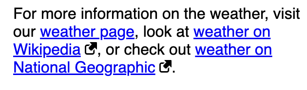
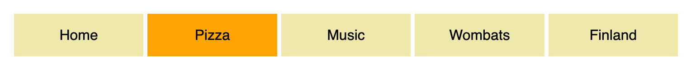

*Source: [Styling links](https://developer.mozilla.org/en-US/docs/Learn_web_development/Core/Text_styling/Styling_links)*

理解 default link styles 的重要性, 学习如何使用 pseudo-classes 来 style links, 以及如何给常见的 interface features(如导航菜单, 选项卡) 中的 links 进行 styles.

# 1 Link states

理解 link 的不同 states, 其可以用 pseudo-classes 进行 style:

- **Link**: 一个有 destination (目标地址) 的 link. 对应 pseudo-class 为 `:link`

- **Visited**: 一个已经被 visited 的 link (在 broswer 的 history 中). 对应 pseudo-class 为 `:visited`

- **Hover**: 一个被 mouse pointer 悬停的 link. 对应 pseudo-class 为 `:hover`.

- **Focus**: 一个被聚焦的 link (例如通过 tab 键盘选中). 对应 pseudo-class 为 `:focus`.

- **Active**: 一个被激活的 link (例如被点击). 对应的 pseudo-class 为 `:active`.

# 2 Default styles

Default links 拥有以下特性:

- Links are underlined.

- Unvisited links are blue.

- Visited links are purple.

- Hovering a link makes the mouse pointer change to a little hand icon.

- Focused links have an outline around them

- Active links are red.

默认的 styles 可通过以下 properties 更改:

- [`color`](https://developer.mozilla.org/en-US/docs/Web/CSS/Reference/Properties/color): text color.

- [`cursor`](https://developer.mozilla.org/en-US/docs/Web/CSS/Reference/Properties/cursor): 鼠标 cursor 的样式 (比如 link 被悬停时的 style).

- [`outline`](https://developer.mozilla.org/en-US/docs/Web/CSS/Reference/Properties/outline): 文本 outline style (比如 link 被 focused 时), 与 border 视觉效果相同, 但是不占用 space.

> Links 的默认样式已经广为人知, 如无特殊情况可以不作修改, 或者要让人能够一目了然.

# 3 Styling links

```css
a {
}

a:link {
}

a:visited {
}

a:focus {
}

a:hover {
}

a:active {
}
```

要按以上顺序, 因为关系是层层递进的. 比如 link 被 activated 的同时往往也是 hovered.

# 4 Including icons on links

在 link 中插入 icons 用于表示其类型, 比如插入一个 icon 在其后面表示 external link, 此时可以使用 pseudo-element [`::after`](https://developer.mozilla.org/en-US/docs/Web/CSS/Reference/Selectors/::after).



# 5 Styling links as buttons

Links 通常也被 styled 为 buttons 用于导航栏 [`<nav>`](https://developer.mozilla.org/en-US/docs/Web/HTML/Reference/Elements/nav).

