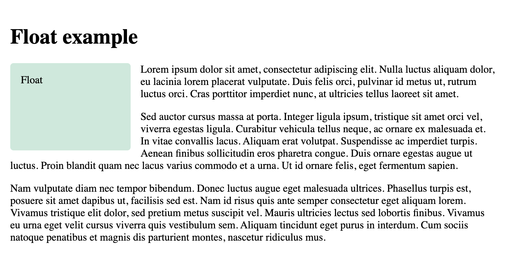
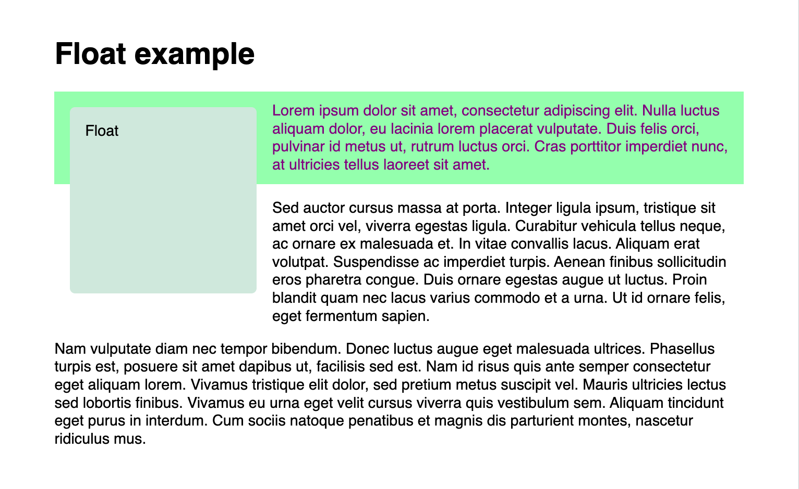
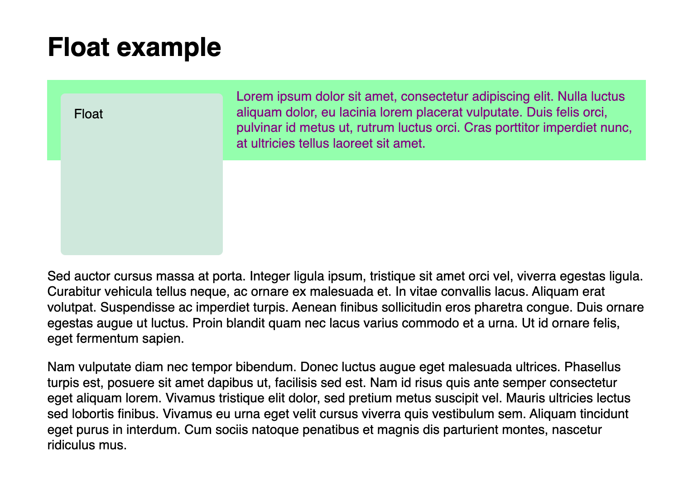
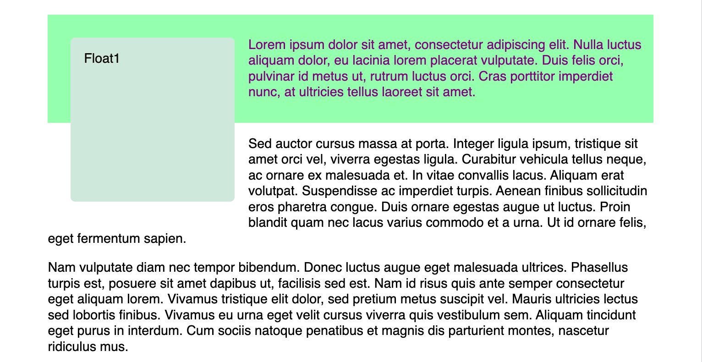

*Source: [Floats](https://developer.mozilla.org/en-US/docs/Learn_web_development/Core/CSS_layout/Floats)*

# 1 The background of floats

[`float`](https://developer.mozilla.org/en-US/docs/Web/CSS/Reference/Properties/float) property 是为了让 image 能够在 text column 中 floating 的,  此时 text 能够 wrap around (环绕) 在 image 的一侧.

FLoat 布局过去常用去创建多列并排显示, 现在已经有了更好的方式.

# 2 A float example

假设有一个 normal flow 的 webpage.

## 2.1 Floating the box

当把一个 block 改为 float layout 时, 后面 block 中的 text content 就会占满右侧空的 space.

## 2.2 Visualizing the float

如果把后面的 block 加上背景色.

实际上, float block 被拿出了 normal flow, 而后续的 block 以然在 normal flow 中, 因而其依然占满了 inline space.

而 text content 是被 [line boxes](https://developer.mozilla.org/en-US/docs/Web/CSS/Guides/Display/Visual_formatting_model#line_boxes) 所包含 (包含 text 的 boxes, 而不是该 block container), line boxes 受到 float block 的影响而缩短了.

# 3 Clearing floats

使用 [clear](https://developer.mozilla.org/en-US/docs/Web/CSS/Reference/Properties/clear) property 清除当前以及后续 element 受到 float 到影响.

比如这里的第二段及其后续 text.

`clear` 接受 3 个值:

- `left`: Clear items floated to the left.

- `right`: Clear items floated to the right.

- `both`: Clear any floated items, left or right.

# 4 Clearing boxes wrapped around a float

对于 3 中所示的情景, 在没有 clear 的情况下, 假如将 float block 和第一个段 text 放在同一个 container 中, 其他段 text 放在 container 外, 凭直觉应该也有像 3 中的情况, 然而并不会:

原因很简单, 因为 float block 已经不在 normal flow 之中.

## 4.1 `display： flow-root`

此时只需要在该 container 中应用该 property-value 即可解决该问题.
