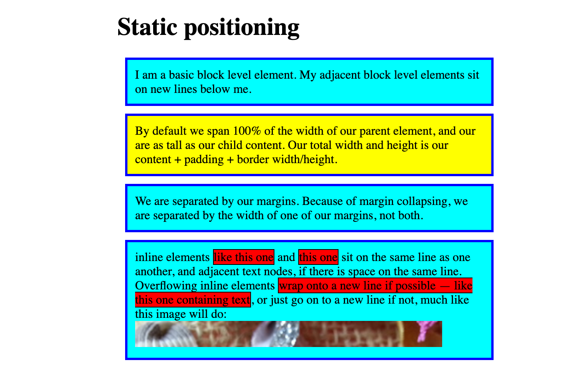
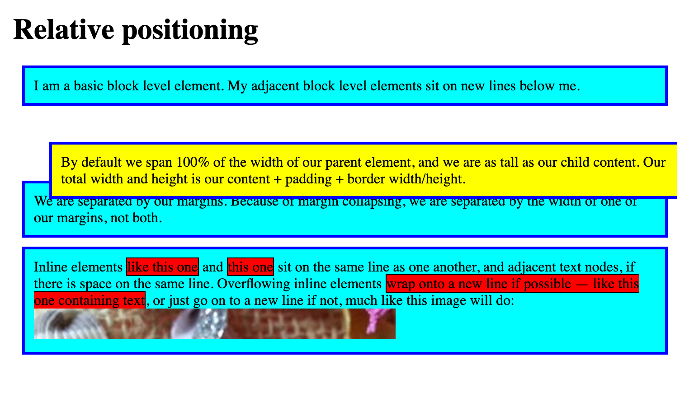
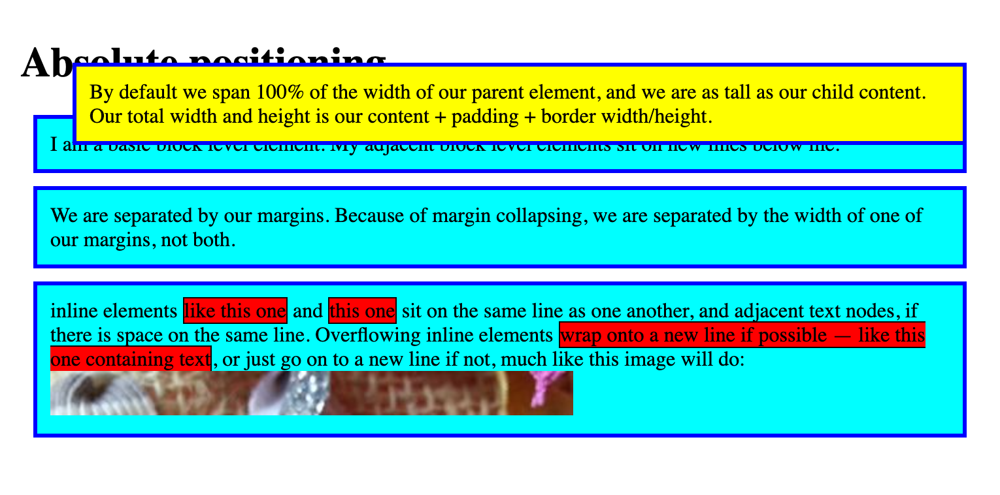

*Source: [Positioning](https://developer.mozilla.org/en-US/docs/Learn_web_development/Core/CSS_layout/Positioning)*

将 elements 从 normal document flow 中抽出, 使其表现独特行为. 例如重叠于其他 elements 上, 或者固定在相对于 browser viewport 的某一位置上.

# 1 Introducing positioning

[position](https://developer.mozilla.org/en-US/docs/Web/CSS/Reference/Properties/position) property is all you need.

初始示例界面:



# 2 Static positioning

默认行为, 意思是 "put the element into its default position in the normal flow — nothing special to see here."

# 3 Relative positioning

当 elements 在 normal flow 中占据了 position, 便可以调整其相对于该 position 的位置.

```css
postion： relative
```

## 3.1 Introducing top, bottom, left and right

使用 [top](https://developer.mozilla.org/en-US/docs/Web/CSS/Reference/Properties/top), [bottom](https://developer.mozilla.org/en-US/docs/Web/CSS/Reference/Properties/bottom), [left](https://developer.mozilla.org/en-US/docs/Web/CSS/Reference/Properties/left), and [right](https://developer.mozilla.org/en-US/docs/Web/CSS/Reference/Properties/right) 来控制 elements 的 relative postion.

例如对第 2 段 text 应用:

```css
top: 30px;
left: 30px;
```

该段相对于其 postion 按照以 left-top 为原点进行了移动:



## 4 Absolute positioning

```css
position: absolute;
```

该 block 所占用的 space 在 normal flow 中已不复存在:



此时其相对于 the containing element (the initial containing block, 下面会解释) 进行 absolute postioning.

## 4.1 Positioning contexts

上述的 the containing element 取决于 positioned element 的 ancestors 的 `postion` value.

默认情况下, ancestors 的 `postion` value 为 `static`, 那么 the containing element 就是 initial containing block, 其 dimension 与 viewport 相同, 同时其也是 `<html>` 的 container. 因而 absolute positioned block 会显示在 `<html>` 之外.

要改变其相对定位 element (即修改 positioning context), 只需要在其中一个 ancestor 中设置:

```css
postion: relative;
```

## 4.2 Introducing z-index

Postioned elements 如果出现 overlap 的情况, 那么如何决定谁覆盖谁.

默认情况下, 按照在 HTML 中的顺序, 越后面优先级越高.

z-index property 可以用于修改该优先级, 默认值为 0, 接受正负数, 值越大优先级越高.

# 5 Fixed positioning

