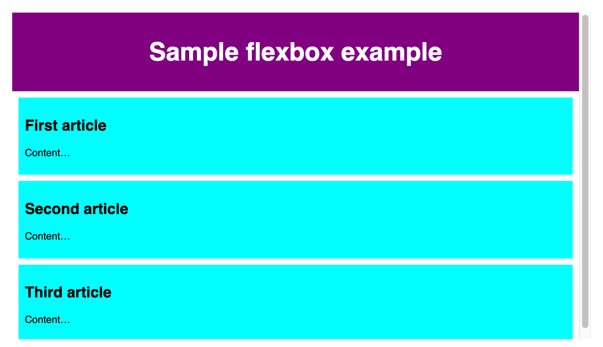
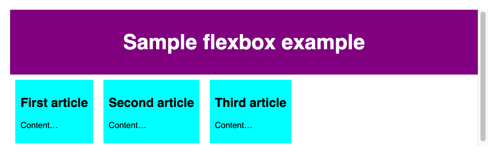
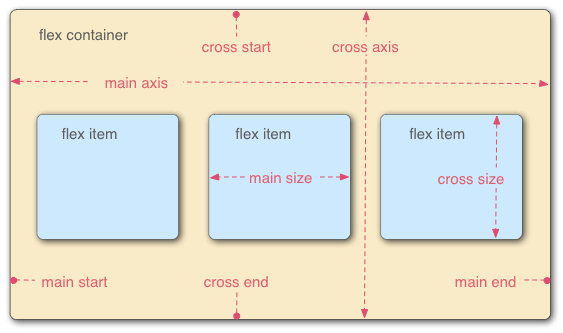
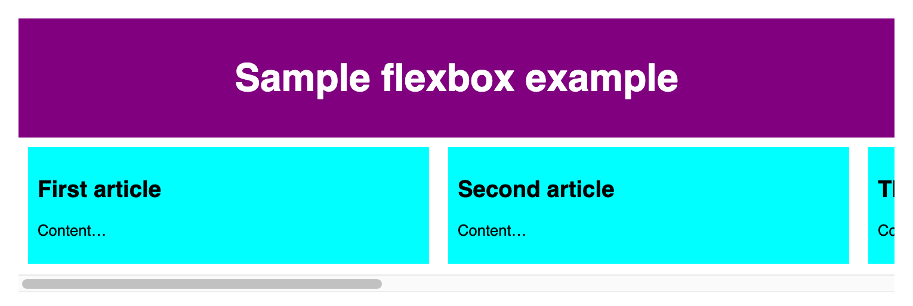
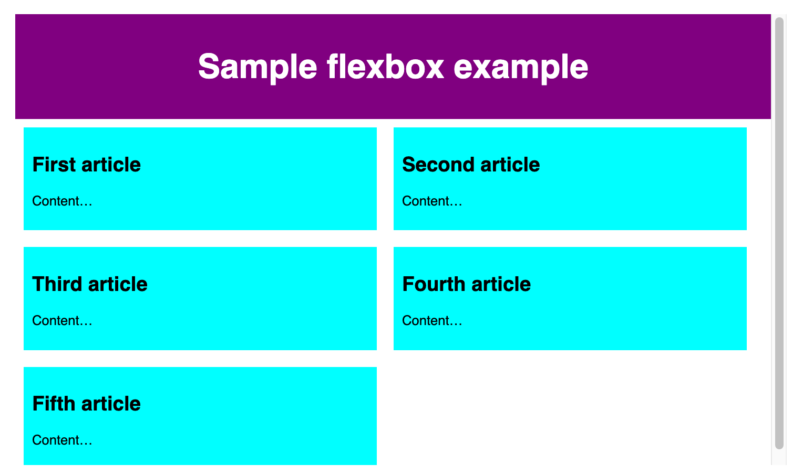
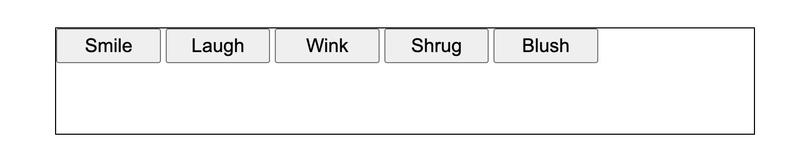
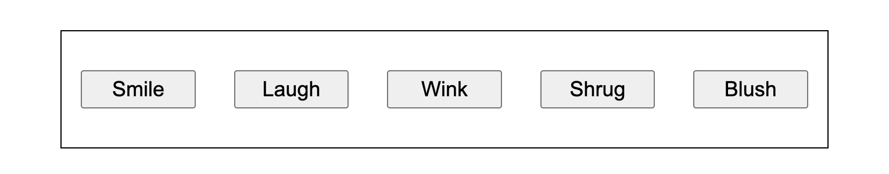
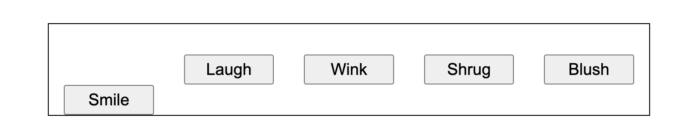

*Source: [Flexbox](https://developer.mozilla.org/en-US/docs/Learn_web_development/Core/CSS_layout/Flexbox)*

[Flexbox](https://developer.mozilla.org/en-US/docs/Web/CSS/Guides/Flexible_box_layout) 是一种 one-dimensional layout method. Items 可以延展 (flex) 以填充额外空间, 或 shrink 以适应更小的空间.

# 1 Why flexbox？

> 直接引用.

Flexbox 能做到:

- Vertically center a block of content inside its parent.

- Make all the children of a container take up an equal amount of the available width/height, regardless of how much width/height is available.

- Make all columns in a multiple-column layout adopt the same height even if they contain a different amount of content.

> Note: Scrimba's introductory [Flexbox](https://scrimba.com/learn-html-and-css-c0p/~017?via=mdn) MDN learning partner scrim provides an interactive guide covering how common flexbox is on the web and therefore why it is so important to learn, and walks you through a typical use case that demonstrates the power of flexbox.

# 2 Introducing a simple example



一个 `<header>`, 一个 `<section>` 包含 3 个 `<article>`.

# 3 Specifying what elemetns to lay out as flexible boxes

让 elemtns 变为 flexible boxes, 需要将其 parent element 设置为:

```css
display: flex;
```

此时该 parent element 变为 flex container, 被渲染为一个 [block-level content](https://developer.mozilla.org/en-US/docs/Glossary/Block-level_content), 其 children 将转换为 flex items.



此时 item 拥有同样的 height.

# 4 The flox model



Flex items 的两个 layout 维度: main 和 cross.

# 5 Columns or rows？

`flex-direction` property 用于指定 main axis 的方向, 默认为 `row` (水平方向).

可以修改为 `column` (垂直方向), 那么此时 cross axis 就为水平方向.

> You can also lay out flex items in a reverse direction using the row-reverse and column-reverse values. Experiment with these values too!

# 6 Wrapping

当 flex item 过多时就会 overflow 其 container, 从而打破其 layout:



可以通过该方式解决上述问题:

```css
flex-wrap: wrap;
```



此时 overflow 的 item 将会移动到 next line.

# 7 `flex-flow` shorthand

```css
flex-direction: row;
flex-wrap: wrap;
```

可以写为:

```css
flex-flow: row wrap;
```

# 8 Flexible sizing of flex items

可以设置 item 占有 available space 的 proportion (比例).

例如:

```css
article {
  flex: 1;
}
```


此时每个 article 所占的 proportion 都是相同的, 即 $\frac{1}{3}$. 分子为各个 item 所设置的占比, 分母为所有的 item 占比总和.

也可以设置 item 最小的所占 space:

```css
flex: 1 100px;
```

此时各个 item 先占用最小的 space, 然后再分配剩余的 available space.

# 9 flex: shorthand versus longhand

[`flex`](https://developer.mozilla.org/en-US/docs/Web/CSS/Reference/Properties/flex) 是一个 shorthand property, 可以指定 3 个不同的 value:

- [`flex-grow`](https://developer.mozilla.org/en-US/docs/Web/CSS/Reference/Properties/flex-grow): The unitless proportion value we discussed above.

- [`flex-shrink`](https://developer.mozilla.org/en-US/docs/Web/CSS/Reference/Properties/flex-shrink): 当 flex items overflowing container 时, 指定 item 进行 shrink 的程度以避免 overflow.

- [`flex-basis`](https://developer.mozilla.org/en-US/docs/Web/CSS/Reference/Properties/flex-basis): The minimum size value we discussed above.

避免使用 longhand.

# 10 Horizontal and vertical alignment

假设一个 `<div>` 中包含 5 个 `<button>`, 默认渲染为:



将 `<div>` 修改为:

```css
display: flex;
align-items: center;
justify-content: space-around;
```



`align-items` property 控制 flex items 在 cross axis 的位置:

- 默认为 `normal`, 其表现同 `stretch`. 其会将所有 flex items 沿着 cross axis 延展以填充其 parent. 如果 parent 在 cross axis direction 没有 fixed size, 那么所有 flex items 将会与最高(or宽)的 flex item 同高(or宽). 

- `center` value 会保持 item 的 intrinsic dimensions, 也就是不会被 strech, 然后在 cross axis direction 上被 centered.

- 可以使用 `flex-start`, `self-start` or `start` and `flex-end`, `self-end` or `end` 使 all items 对齐在 cross axis 的 start 或 end. `baseline` value 将会选择每个 item 中第一行 text 底部与 cross start 距离最远的那个底部作为 baseline, 其他 item 与其对齐.

使用 `align-self` property 在 flex item 中实现上述功能.

例如:

```css
align-self: flex-end;
```

用于第一个 button:



`justify-content` property 控制 flex items 在 main axis 的位置:

- 默认为 `normal`, 其表现同 `start`. 其会将所有 flex items 放置于 main start. 使用 `end` or `flex-end` 将其放置于 main end.

- `left` and `right` 等同于 `start` or `end`, 取决于 writing mode direction.

- `center` value 让 items 在 main axis direction 上 centered.

- `space-around` value 将 items 均匀分布在 main axis 上, 并在两端留有 space.

- `space-between` value 将 items 均匀分布在 main axis 上, 两端不留有 space.

> The [justify-items](https://developer.mozilla.org/en-US/docs/Web/CSS/Reference/Properties/justify-items) property is ignored in flexbox layouts.

# 11 Ordering flex items

[`order`](https://developer.mozilla.org/en-US/docs/Web/CSS/Reference/Properties/order) property 改变 flex items 的 layout order, 不会影响 source order (代码里定义的顺序).

- 默认值为 0, 当 order value 想同时, 按照 source order 排序.

- 值越大排在越后面.

- 可以设置负值.

虽然改变了 layout order, 但是使用 Tab 进行 focus 的时候依然是按照 source order.

# 12 Nested flex boxes

Flex item 也可以设置为 flex container.
