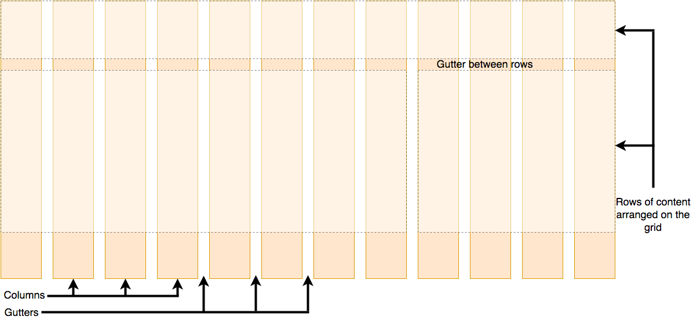
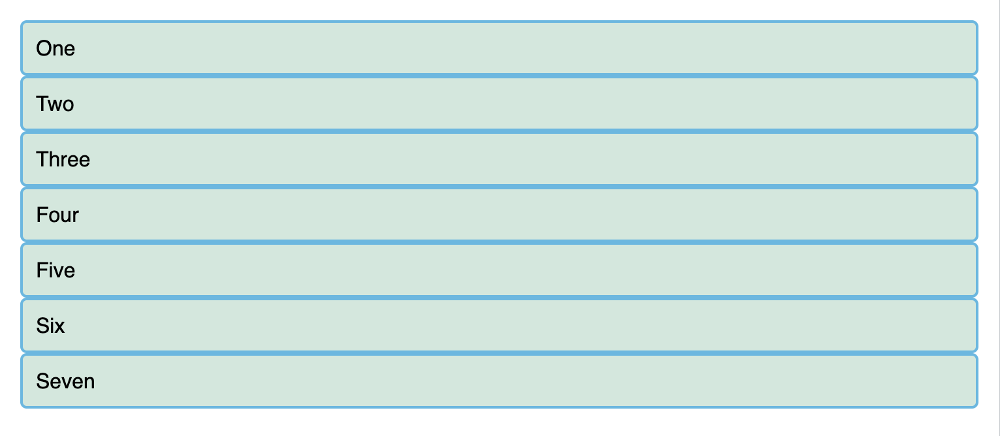
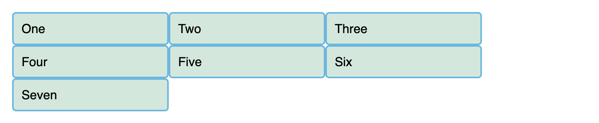
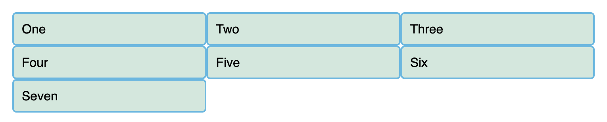
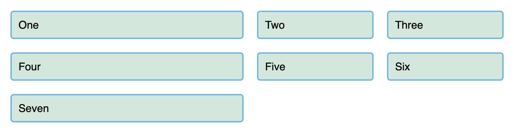
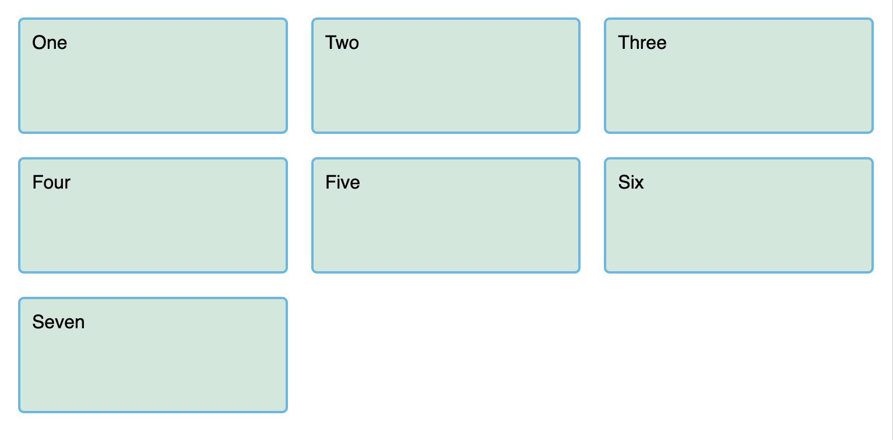
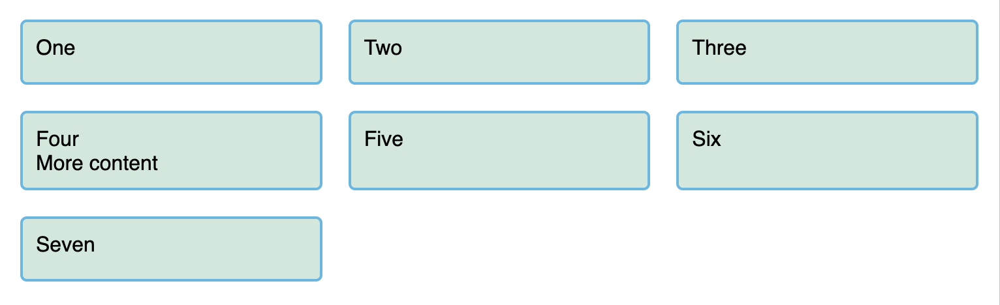

*Source: [CSS grid layout](https://developer.mozilla.org/en-US/docs/Learn_web_development/Core/CSS_layout/Grids)*

CSS grid layout 是一种 two-dimensional layout system.

# 1 What is grid layout?

Grid 由横纵线条组成, 使得 elements 可以据此进行对齐.

Grid 通常由 columns, rows 组成, columns 和 rows 之间的是 gaps (通常叫做 gutters).



> Gap 就是被撑开了的 line.

# 2 Creating your grid in CSS

> [Build a Classic Layout FAST in CSS grid.](https://youtu.be/KOvGeFUHAC0)

## 2.1 Defining a grid

假设一个 `<div>` 中包含多个 `<div>`. 只需在 container 中设置:

```css
display: grid;
```



当然此时页面是没有任何变化的.

添加以下属性:

```css
grid-template-columns: 200px 200px 200px;
```



分出了 3 个宽度为 200px 的 columns.

# 3 Interactive recap of grid concepts

## 3.1 Flexible grids with the [`fr`](https://developer.mozilla.org/en-US/docs/Web/CSS/Reference/Values/flex_value) unit



`fr` 表示在 available space 所占到分子比例. 比如:

```css
grid-template-columns: 1fr 1fr 1fr;
```

表示 3 列, 每列所占 available space 的 $\frac{1}{3}$.

> 注意这里指的是 available space, 热不是 all space.

## 3.2 Gaps between tracks

在 tracks 之间创建 gaps 使用:

- `column-gap`: columns 间的 gaps

- `row-gap`: rows 间的 gaps

- `gap`: as a shorthand for both

例如使用:

```css
gap: 20px
```



gap 不能是 `fr` unit.

## 3.3 Repeating track listings

使用 `repeat()` function 快速创建重复的 track listing.

例如 3.1 中的示例可以更改为:

```css
grid-template-columns: repeat(3, 1fr);
```

## 3.4 Implicit and explicit grids

二者的区别:

- **Explicit grid**: 使用 `grid-template-columns` or `grid-template-rows` 显式创建的.

- **Implicit grid**: 当 content 超过 grid 既有的范围时会对 grid 进行 extend. 例如上述的例子, 多余的 items 会自动放置到下一行.

默认情况下 implicit grid 为 `auto`-size, 一般都足以容纳其 content. 但是也可以通过 [`grid-auto-rows`](https://developer.mozilla.org/en-US/docs/Web/CSS/Reference/Properties/grid-auto-rows) or [`grid-auto-columns`](https://developer.mozilla.org/en-US/docs/Web/CSS/Reference/Properties/grid-auto-columns) 显式更改该行为.

例如:

```css
grid-auto-rows: 100px;
```



Implict grid row 拥有了 minimum height.

## 3.5 The [minmax()](https://developer.mozilla.org/en-US/docs/Web/CSS/Reference/Values/minmax) function

该 function 接受设置一个最小值和一个最大值以定义一个 range 动态适应 content.

例如:

```css
grid-auto-rows: minmax(50px, auto);
```

## 3.6 As many columns as will fit

能定义多少 columns 就自动定义多少 columns. 例如:

```css
grid-template-columns: repeat(auto-fit, minmax(230px, 1fr));
grid-auto-rows: minmax(50px, auto);
```



这里根据 `230px` 推算出 3 coulmns, 随后将剩余 available space 按照 `1fr` 平均分配给各 column.

# 4 Line-based placement

Grid 中的有编号从 1 开始的 lines, 基于文档的 [writing mode](https://developer.mozilla.org/en-US/docs/Web/CSS/Guides/Writing_modes). (比如 English 是 left-to-right, top-to-down).

让 items 基于 start line 和 end line 进行 position 可以用:

- [`grid-column-start`](https://developer.mozilla.org/en-US/docs/Web/CSS/Reference/Properties/grid-column-start)

- [`grid-column-end`](https://developer.mozilla.org/en-US/docs/Web/CSS/Reference/Properties/grid-column-end)

- [`grid-row-start`](https://developer.mozilla.org/en-US/docs/Web/CSS/Reference/Properties/grid-row-start)

- [`grid-row-end`](https://developer.mozilla.org/en-US/docs/Web/CSS/Reference/Properties/grid-row-end)

上述接受 line 编号, 有 shorthand 形式, 使用 `/`(forward slash) 分隔:

- [`grid-column`](https://developer.mozilla.org/en-US/docs/Web/CSS/Reference/Properties/grid-column) shorthand for grid-column-start and grid-column-end

- [`grid-row`](https://developer.mozilla.org/en-US/docs/Web/CSS/Reference/Properties/grid-row) shorthand for grid-row-start and grid-row-end

例如:

```css
header {
  grid-column: 1 / 3;
  grid-row: 1;
}
main {
  grid-column: 2;
  grid-row: 2;
}
aside {
  grid-column: 1;
  grid-row: 2;
}
footer {
  grid-column: 1 / 3;
  grid-row: 3;
}
```


`1/3` 表示从 line 1 开始到 line 3 结束, 所以这里的 `header` 跨越了 2 columns.

> Note: You can also use the value -1 to target the end column or row line, then count inwards from the end using negative values. Note also that lines count always from the edges of the explicit grid, not the [implicit grid](https://developer.mozilla.org/en-US/docs/Glossary/Grid).

# 5 Positioning with [`grid-template-areas`](https://developer.mozilla.org/en-US/docs/Web/CSS/Reference/Properties/grid-template-areas)

给 elements 命名, 然后使用这些名字进行 layout.

例如:

```css
.container {
  display: grid;
  grid-template-areas:
    "header header"
    "sidebar content"
    "footer footer";
  grid-template-columns: 1fr 3fr;
  gap: 20px;
}
header {
  grid-area: header;
}
main {
  grid-area: content;
}
aside {
  grid-area: sidebar;
}
footer {
  grid-area: footer;
}
```


The rules for `grid-template-areas` are as follows:

- You need to have every cell of the grid filled.

- To span across two cells, repeat the name.

- To leave a cell empty, use a . (period).

- Areas must be rectangular — for example, you can't have an L-shaped area.

- Areas can't be repeated in different locations.

# 6 Nesting grids and [subgrid](https://developer.mozilla.org/en-US/docs/Web/CSS/Guides/Grid_layout/Subgrid)

将 item 设为 `display: grid` 即可.

如果想继承 parent 的 tracks 使用 `subgrid`, 例如:

```css
grid-template-columns: subgrid;
```
