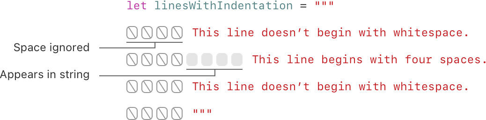
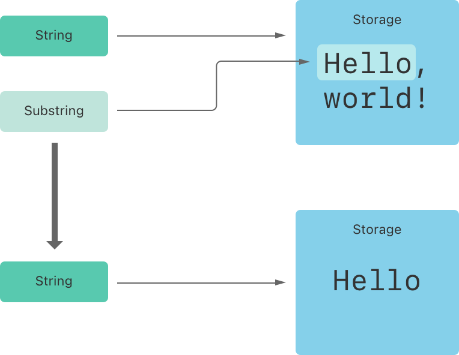
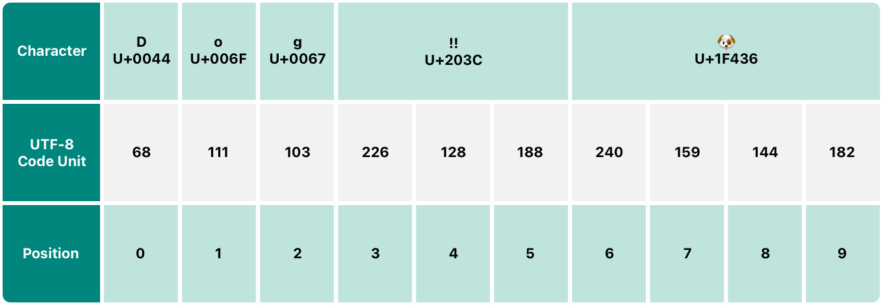
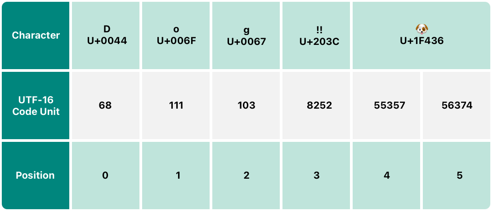
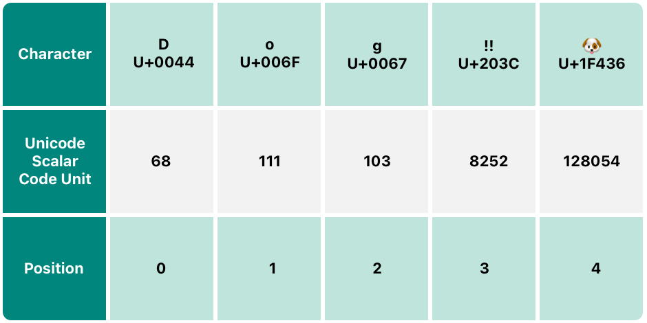

The contents of a String can be accessed in various ways, including as a collection of Character values.

## 1 String Literals

Surrounded by double quotation marks `"`.

### 1.1 Multiline String Literals

Surrounded by three double quotation marks `"""`.

如果想从 readability 层面进行 line break 可以使用 `\`, 它并不会包含在最终的 string's value 中.

关于 indentation:



### 1.2 Special Characters in String Literals

Include:

- The escaped special characters \0 (null character), \\\\ (backslash), \t (horizontal tab), \n (line feed), \r (carriage return), \" (double quotation mark) and \' (single quotation mark)

- An arbitrary Unicode scalar value, written as \u{n}, where n is a 1–8 digit hexadecimal number

```swift
let wiseWords = "\"Imagination is more important than knowledge\" - Einstein"
// "Imagination is more important than knowledge" - Einstein
let dollarSign = "\u{24}"        // $,  Unicode scalar U+0024
let blackHeart = "\u{2665}"      // ♥,  Unicode scalar U+2665
let sparklingHeart = "\u{1F496}" // 💖, Unicode scalar U+1F496
```

### 1.3 Extended String Delimiters

将 string literals 包含在 number signs (#) 中, 即可改变 special charaters 的 default behavior, 要想 special behavior 生效, 就要加上相应个数的 `#`.

例如 `"Line 1\nLine 2"` 修改为 `#"Line 1\nLine 2"#`, 那么想要 `\n` 生效, 就要修改为 `#"Line 1\#nLine 2"#`.

`#` 的个数并没有限制, 比如 `##"Line 1\##nLine 2"##` 也是等效的.

### 1.4 Initializing an Empty String

2 ways:

```swift
var emptyString = ""
var emptyString = String()
```

判断 string 是否 empty:

```swift
emptyString.isEmpty
```

## 2 String Mutability

`var` 让 String 可被 modified, `let` 则不可被 modified.

## 3 String Are Value Types

Value types 意味着对 String 的 copy 或者 pass 都是 value 传递而不是 reference 传递.

> Value types are described in [Structures and Enumerations Are Value Types](https://docs.swift.org/swift-book/documentation/the-swift-programming-language/classesandstructures#Structures-and-Enumerations-Are-Value-Types).

## 4 Working with Characters

`String` 是 `Character` 的 collection, 所以可以 iterating over the string:

```swift
for character in "Dog!🐶" {}
```

创建一个 `Character`:

```swift
let exclamationMark: Character = "!"
```

使用 `Character` array 可以创建 `String`:

```swift
let catCharacters: [Character] = ["C", "a", "t", "!", "🐱"]
let catString = String(catCharacters)
```

## 5 Concatenating Strings and Characters

使用 `+` 可以 concatenating strings.

使用 `String` 的 `append()` 可以 concatenating `Character` 到 `String` 中.

## 6 String Interpolation

使用 `\()` 的方式将 constans, variables, literals or expressions 插入到一个 string 中.

## 6 Unicode

Unicode is an international standard for encoding, representing, and processing text in different writing systems. 

### 6.1 Unicode Scalar Values

Swift’s native String type is built from Unicode scalar values.

### 6.2 Extended Grapheme Clusters

Every instance of Swift’s Character type represents a single extended grapheme cluster. An extended grapheme cluster is a sequence of one or more Unicode scalars that (when combined) produce a single human-readable character.

直接看 example, 简单理解就是某些 `Character` 可以拆解和组合, 都是独立的:

```swift
let eAcute: Character = "\u{E9}"                         // é
let combinedEAcute: Character = "\u{65}\u{301}"          // e followed by ́

let precomposed: Character = "\u{D55C}"                  // 한
let decomposed: Character = "\u{1112}\u{1161}\u{11AB}"   // ᄒ, ᅡ, ᆫ

let enclosedEAcute: Character = "\u{E9}\u{20DD}" // precomposed is 한, decomposed is 한

let regionalIndicatorForUS: Character = "\u{1F1FA}\u{1F1F8}" // regionalIndicatorForUS is 🇺🇸
```

## 7 Counting Characters

访问 `String` 的 `count` 属性计算 `Character` 个数.

正如上面所说, `Character` 使用了 Extended Grapheme Clusters, 所以最终个数的计算不会拆解到最细粒度, 而是组合后的 human-readable characters:

```swift
var word = "cafe"
print("the number of characters in \(word) is \(word.count)")
// Prints "the number of characters in cafe is 4".

word += "\u{301}"    // COMBINING ACUTE ACCENT, U+0301

print("the number of characters in \(word) is \(word.count)")
// Prints "the number of characters in café is 4".
```

当然这也导致了看着是同一个 `Character`, 但是其底层 amount of memory to store 是不同的.

> ... be aware that the count property must iterate over the Unicode scalars in the entire string in order to determine the characters for that string.

## 8 Accessing and Modifying a String

Access and modify a string through its methods and properties, or by using subscript syntax.

### 8.1 String Indices

上面提到过, `Character` 使用了 Extended Grapheme Clusters, 因而在 `String` 无法使用 integer values 进行 index.

Swfit 提供了 human-readable 的方式进行 index. 直接看 example:

```swift
let greeting = "Guten Tag!"
greeting[greeting.startIndex]
// G
greeting[greeting.index(before: greeting.endIndex)]
// !
greeting[greeting.index(after: greeting.startIndex)]
// u
let index = greeting.index(greeting.startIndex, offsetBy: 7)
greeting[index]
// a
```

需要注意的是 `endIndex` 是最后一个 `Character` 的下一位.

对 `String` 进行 iterating:

```swift
for index in greeting.indices {
    print("\(greeting[index]) ", terminator: "")
}
```

> 上述方式也适用于 any type that conforms to the Collection protocol. This includes String, as shown here, as well as collection types such as Array, Dictionary, and Set.

### 8.2 Inserting and Removing

`String` 中 insert `Character` 用 `insert(_:at:)`:

```swift
var welcome = "hello"
welcome.insert("!", at: welcome.endIndex)
// welcome now equals "hello!"
```

insert `String` 用 `insert(contentsOf:at:)`:

```swift
welcome.insert(contentsOf: " there", at: welcome.index(before: welcome.endIndex))
// welcome now equals "hello there!"
```

remove `Character` 用 `remove(at:)`:

```swift
welcome.remove(at: welcome.index(before: welcome.endIndex))
// welcome now equals "hello there"
```

remove `String` 用 `removeSubrange(_:)`:

```swift
let range = welcome.index(welcome.endIndex, offsetBy: -6)..<welcome.endIndex
welcome.removeSubrange(range)
// welcome now equals "hello"
```

> 上述方式也适用于 any type that conforms to the RangeReplaceableCollection protocol. This includes String, as shown here, as well as collection types such as Array, Dictionary, and Set.

## 9 Substrings

获取一个 `String` 的 substring 会得到一个 [`Substring`](https://developer.apple.com/documentation/swift/substring) instance.

`Substring` 会与 original `String` 共享一个 memory region, 直到 original `String` 或 `Substring` 发生修改.

> 涉及 Copy-on-Write 机制, 如果感兴趣可以了解.

将 `Substring` 转换为 `String` 后, 会拥有 own memory region.

```swift
let greeting = "Hello, world!"
let index = greeting.firstIndex(of: ",") ?? greeting.endIndex
let beginning = greeting[..<index]
// beginning is "Hello"

// Convert the result to a String for long-term storage.
let newString = String(beginning)
```




## 10 Comparing Strings

Swift provides three ways to compare textual values: string and character equality, prefix equality, and suffix equality.


### 10.1 String and Character Equality

使用 `==` 与 `!=` compare.

因为 Extended Grapheme Clusters 的缘故, 判断 `String` or `Character` 的 equality 是基于是否拥有 same linguistic meaning and appearance.

> String and character comparisons in Swift aren’t locale-sensitive.

### 10.2 Prefix and Suffix Equality

使用 `String` 的 `hasPrefix(_:)` 和 `hasSuffix(_:)` 分别判断有无 prefix and suffix.

再次强调, 也是基于 Extended Grapheme Clusters.

## 11 Unicode Representations of Strings

Unicode string 可以被 encoded 为不同的 form 进行 store:

- UTF-8 encoding form (which encodes a string as 8-bit code units)

- UTF-16 encoding form (which encodes a string as 16-bit code units)

- UTF-32 encoding form (which encodes a string as 32-bit code units)

下面以 `let dogString = "Dog‼🐶"` 作为 example.

> 简单理解即可

### 11.1 UTF-8 Representation



可以 access 和 iterating `utf8` 属性获取.

### 11.2 UTF-16 Representation



可以 access 和 iterating `utf16` 属性获取.

### 11.3 Unicode Scalar Representation

> equivalent to the string’s UTF-32 encoding form



可以 access 和 iterating `unicodeScalars` 属性获取.