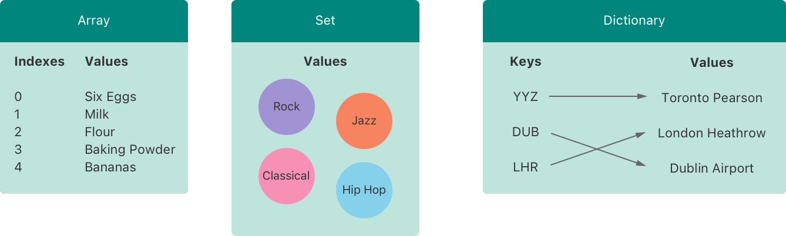
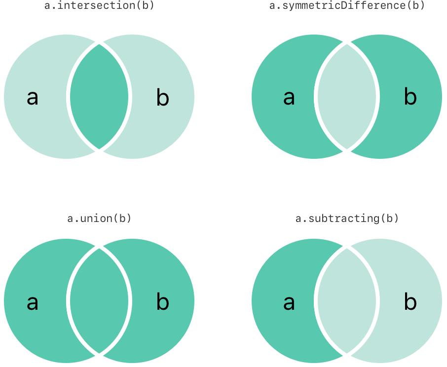
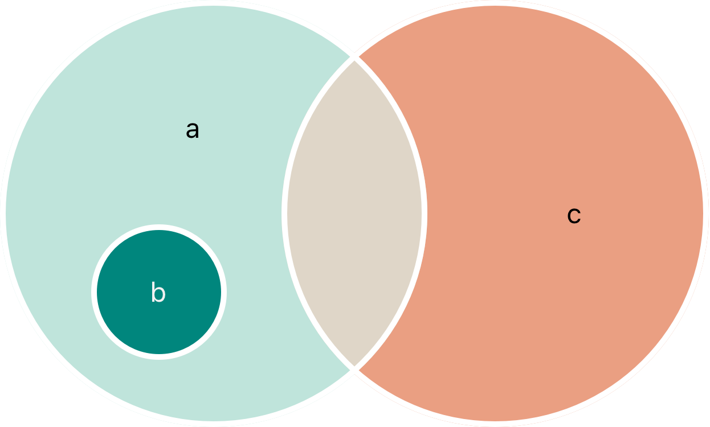

Swift provides three primary collection types, known as arrays, sets, and dictionaries, for storing collections of values.



Swift are always clear about the types of values and keys that they can store.

> Swift’s array, set, and dictionary types are implemented as generic collections. For more about generic types and collections, see [Generics](https://docs.swift.org/swift-book/documentation/the-swift-programming-language/generics).

## 1 Mutability of Collections

`var` 则 mutable, `let` 则 immutable.

> It’s good practice to create immutable collections in all cases where the collection doesn’t need to change. 

## 2 Arrays

An array stores values of the same type in an ordered list.

> Swift’s Array type is bridged to Foundation’s NSArray class.

For more information about using Array with Foundation and Cocoa, see [Bridging Between Array and NSArray](https://developer.apple.com/documentation/swift/array#2846730).

### 2.1 Array Type Shorthand Syntax

Type 的写法为 `Array<Element>`, Shorthand 的写法为 `[Element]` .

### 2.2 Creating an Empty Array

如果 type 已经明确, 可以直接使用 `[]` :

```swift
var someInts: [Int] = []
```

否则, 可以使用 initializer :

```swift
var someInts = [Int]()
```

### 2.3 Creating an Array with a Default Value

创建带有重复 default value 的 `Array` :

```swift
Array(repeating: 0.0, count: 3)
```

3 个 item 数值均为 0.0 的 `Array` .

### 2.4 Creating an Array by Adding Two Arrays Together

使用 `+` 拼接两个 type 是 compatible 的 `Array` .

### 2.5 Creating an Array with Array Literal

使用 square brackets `[]` 的形式 `[<#value 1#>, <#value 2#>, <#value 3#>]` .

### 2.5 Accessing and Modifying an Array

访问 `count` 获取 item 个数.

访问 `isEmpty` 判断是否 item 个数是否为 0.

调用 `append(_:)` 添加 item 到末尾.

拼接两个 arrays 使用 `+` .

使用 subscript syntax 即 `[index]` 访问 item.

可以使用 range index 进行赋值.

> 即使 range index 的长度可以不 equal 要赋值的 items 个数, 这只是导致 range index 对应的切片被 replace 了.

调用 `insert(_:at)` 插入 item 到指定 index 位置.

调用 `remove(at)` 移除并返回指定 index 位置的 item.

调用 `removeLast()` 移除并返回 last item.

### 2.6 Iterating Over an Array

Iterating items:

```swift
for item in #Array {}
```

调用 `enumerated()` iterating items with its indexes:

```swift
for (index, value) in #Array.enumerated() {}
```

## 3 Sets

A *set* stores distinct values of the same type in a collection with no defined ordering. 

> Swift’s Set type is bridged to Foundation’s NSSet class. For more information about using Set with Foundation and Cocoa, see [Bridging Between Set and NSSet](https://developer.apple.com/documentation/swift/set#2845530).

### 3.1 Hash Values for Set Types

A type must be *hashable* in order to be stored in a set — that is, the type must provide a way to compute a *hash value* for itself. 

### 3.2 Set Type Syntax

`Set<Element>` .

### 3.3 Creating an Initializing an Empty Set

使用 initializer syntax: `Set<Element>()` .

如果 type 已经明确, 可以直接使用 `[]` .

### 3.4 Creating a Set with an Array Literal

使用 square brackets [] 的形式 `[<#value 1#>, <#value 2#>, <#value 3#>]` .

### 3.5 Accessing and Modifying a Set

访问 `count` 获取 items 个数.

访问 `isEmpty` 判断 items 个数是否为 0.

调用 `insert(_:)` 插入 item.

调用 `remove(_:)` 移除并返回指定 item.

> 返回值为 optional value, 因为 item 可能不存在.

调用 `removeAll()` 移除所有 items.

调用 `contains(_:)` 判断是否包含指定 item.

### 3.6 Iterating Over a Set

Iterating items:

```swift
for item in #Set {}
```

调用 `sorted()` 按顺序 iterating items:

```swift
for item in #Set.sorted() {}
```

which returns the set’s elements as an array sorted using the < operator.

## 4 Performing Set Operations

### 4.1 Fundamental Set Operations



- Use the intersection(_:) method to create a new set with only the values common to both sets.

- Use the symmetricDifference(_:) method to create a new set with values in either set, but not both.

- Use the union(_:) method to create a new set with all of the values in both sets.

- Use the subtracting(_:) method to create a new set with values not in the specified set.

### 4.2 Set Membership and Equality



- Use the “is equal” operator (==) to determine whether two sets contain all of the same values.

- Use the isSubset(of:) method to determine whether all of the values of a set are contained in the specified set.

- Use the isSuperset(of:) method to determine whether a set contains all of the values in a specified set.

- Use the isStrictSubset(of:) or isStrictSuperset(of:) methods to determine whether a set is a subset or superset, but not equal to, a specified set.

- Use the isDisjoint(with:) method to determine whether two sets have no values in common.

## 5 Dictionaries

A dictionary stores associations between keys of the same type and values of the same type in a collection with no defined ordering.

> Swift’s Dictionary type is bridged to Foundation’s NSDictionary class. For more information about using Dictionary with Foundation and Cocoa, see Bridging [Between Dictionary and NSDictionary](https://developer.apple.com/documentation/swift/dictionary#2846239).

### 5.1 Dictionary Type Shorhand Syntax

Type 的写法 `Dictionary<Key, Value>`, shorthand 的写法 `[Key: Value]` .

### 5.2 Creating an Empty Dictionary

使用 initializer syntax:

```swift
var namesOfIntegers: [Int: String] = [:]
```

context 明确时可以直接使用 `[:]` .

### 5.3 Creating a Dictionary with Dictinary Literal

`[<#key 1#>: <#value 1#>, <#key 2#>: <#value 2#>, <#key 3#>: <#value 3#>]` .

### 5.4 Accessing and Modifying a Dictionary

访问 `count` 获取 items 个数.

访问 `isEmpty` 判断 items 个数是否为 0.

使用 subscript syntax 即 `[key]` 指定 key 更新或添加 item.

调用 `updateValue(_:forKey:)` 根据指定 key 更新 item.

> 返回值为 optional value, 因为 key 可能不存在.

使用 subscript syntax 即 `[key]` 指定 key 访问 item.

> 返回值为 optional value, 因为 key 可能不存在.

使用 subscript syntax 即 `[key]` 指定 key 为 `nil` 来 remove 一个 key-value pair.

调用 `removeValue(forKey:)` 根据指定 key 移除 item.

> 返回值为 optional value, 因为 key 可能不存在.

### 5.5 Iterating Over Dictionary

Iterating key-value pairs:

```swift
for (key, value) in #Dictionary {}
```

访问 `key` iterating keys:

```swift
for key in #Dictionary.keys
```

访问 `value` iterating values.

`key` 和 `value` 属性可以再调用 `sorted()` 访问进行顺序访问.

将 `keys` 转换为 array 的 API 形式 `[Type](#Dictionary.keys)` ; `values` 同.
